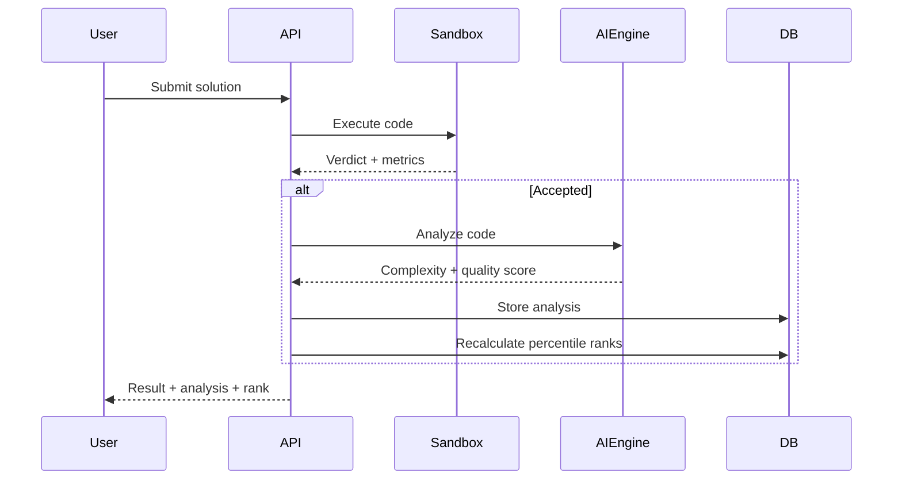
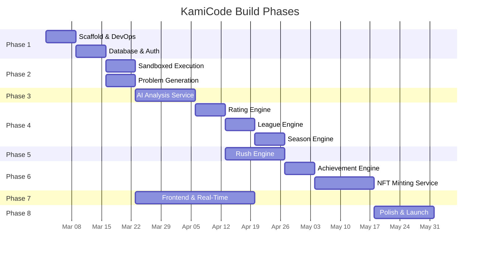

# KamiCode — Component-by-Component Roadmap

> **AI-Native Competitive Programming Platform**
> Depth + Speed → Verifiable On-Chain Credentials

This roadmap decomposes the platform into **10 core components** and organises them across **8 delivery phases**, each with clear inputs, outputs, dependencies, and acceptance criteria.

---

## Architecture at a Glance

```mermaid
graph TD
    subgraph Frontend
        FE[Next.js App]
    end

    subgraph Backend — Core Engines
        DE[Deterministic Engine]
        AI[AI Reasoning Engine]
        RE[Rush Engine]
        RT[Rating Engine]
        LE[League Engine]
        SE[Season Engine]
        AE[Achievement Engine]
    end

    subgraph Blockchain Layer
        NFT[NFT Minting Service]
        META[Metadata Storage — IPFS]
        SC[Smart Contracts — ERC-721]
    end

    subgraph Infrastructure
        DB[(PostgreSQL)]
        CACHE[(Redis)]
        QUEUE[Task Queue — Celery]
        SANDBOX[Sandboxed Runner]
    end

    FE --> DE
    FE --> AI
    FE --> RE
    DE --> SANDBOX
    DE --> RT
    AI --> RT
    RE --> RT
    RT --> LE
    LE --> SE
    SE --> AE
    AE --> NFT
    NFT --> META
    NFT --> SC
    DE --> DB
    RT --> DB
    LE --> DB
    SE --> DB
    AE --> CACHE
    RE --> CACHE
```

---

## Recommended Tech Stack

| Layer | Technology |
|---|---|
| Frontend | Next.js 14 (App Router), TypeScript, Tailwind CSS, Framer Motion |
| Backend API | FastAPI (Python) |
| Database | PostgreSQL 16 + pgvector |
| Cache / Realtime | Redis 7 + Redis Streams |
| Task Queue | Celery + Redis broker |
| Code Sandbox | Docker containers (per-submission isolation) |
| AI Engine | OpenAI GPT-4o / Claude via API |
| Blockchain | Ethereum L2 (Base / Polygon) |
| Smart Contracts | Solidity + Hardhat |
| NFT Metadata | IPFS via Pinata |
| Auth | NextAuth.js + wallet connect (RainbowKit) |
| CI/CD | GitHub Actions |
| Hosting | Vercel (frontend) + Railway / AWS ECS (backend) |

---

## Phase 1 — Foundation & Infrastructure (Weeks 1–2)

> **Goal:** Project scaffold, database, auth, and deployment pipeline.

### Component 1: Project Scaffold & DevOps

| Item | Detail |
|---|---|
| **What** | Mono-repo structure, linting, CI/CD, Docker Compose for local dev |
| **Deliverables** | `kamicode/` mono-repo with `frontend/`, `backend/`, `contracts/`, `infra/` directories |
| **Acceptance** | `docker compose up` starts all services; CI runs lint + type-check |

```
kamicode/
├── frontend/          # Next.js app
├── backend/           # FastAPI app
│   ├── app/
│   │   ├── api/       # Route handlers
│   │   ├── core/      # Config, security, deps
│   │   ├── engines/   # All engine modules
│   │   ├── models/    # SQLAlchemy models
│   │   ├── schemas/   # Pydantic schemas
│   │   └── services/  # Business logic
│   ├── sandbox/       # Docker sandbox runner
│   └── tests/
├── contracts/         # Solidity smart contracts
├── infra/             # Docker, Terraform, etc.
└── docs/
```

### Component 2: Database & Auth

| Item | Detail |
|---|---|
| **What** | PostgreSQL schema, Alembic migrations, JWT auth + wallet auth |
| **Tables** | `users`, `sessions`, `wallets` |
| **Acceptance** | Register / Login / Link Wallet flows work end-to-end |

**Core User Model:**
```
users
├── id (UUID)
├── username (unique)
├── email (unique)
├── password_hash
├── wallet_address (nullable)
├── classical_rating (default 1200)
├── blitz_rating (default 1200)
├── league_tier (default 'bronze')
├── created_at
└── updated_at
```

---

## Phase 2 — Deterministic Engine (Weeks 3–4)

> **Goal:** Securely execute user code, validate correctness, capture metrics.

### Component 3: Sandboxed Code Execution

| Item | Detail |
|---|---|
| **What** | Docker-based sandbox that runs user code against test cases |
| **Languages** | Python, JavaScript, C++, Java (start with Python + JS) |
| **Constraints** | CPU limit (2s), memory limit (256 MB), network disabled, filesystem read-only |
| **Input** | `{ code, language, test_cases[] }` |
| **Output** | `{ passed, failed, runtime_ms, memory_kb, stdout, stderr }` |
| **Acceptance** | 100% isolation; timeout kills; correct verdicts for 20+ test problems |

**Key Tables:**
```
problems
├── id, title, slug
├── description (markdown)
├── difficulty (easy/medium/hard)
├── test_cases (JSONB — hidden + sample)
├── constraints
├── tags[]
├── generated_by (AI model ID)
├── daily_date (nullable — date it was the Daily Challenge)
└── created_at

submissions
├── id, user_id, problem_id
├── code, language
├── verdict (accepted/wrong/tle/mle/runtime_error)
├── runtime_ms, memory_kb
├── passed_count, total_count
├── ai_analysis_id (FK, nullable)
├── submitted_at
└── is_daily (bool)
```

### Component 4: Problem Generation Pipeline

| Item | Detail |
|---|---|
| **What** | AI-powered pipeline that generates a fresh problem each day |
| **Flow** | `Select topic/difficulty → LLM generates problem + test cases → Human-in-loop review → Publish` |
| **Safeguards** | Duplicate detection, difficulty calibration, minimum 15 test cases per problem |
| **Acceptance** | Pipeline generates 7 consecutive daily problems without manual intervention |

---

## Phase 3 — AI Reasoning Engine (Weeks 5–6)

> **Goal:** Evaluate code quality beyond pass/fail.

### Component 5: AI Analysis Service

| Item | Detail |
|---|---|
| **What** | Sends accepted code to an LLM for deep analysis |
| **Analysis Dimensions** | Time complexity, space complexity, approach quality, code style, edge-case handling |
| **Output Schema** | `{ time_complexity, space_complexity, approach_name, quality_score (0–100), feedback }` |
| **Comparison** | Ranks submission efficiency against all accepted solutions for the same problem |
| **Acceptance** | ≥90% accuracy on complexity estimation for a benchmark set of 50 solutions |

**Key Table:**
```
ai_analyses
├── id, submission_id
├── time_complexity (e.g. "O(n log n)")
├── space_complexity (e.g. "O(n)")
├── approach_name (e.g. "Two Pointer")
├── quality_score (0–100)
├── feedback (text)
├── percentile_rank (float)
├── model_used
└── analyzed_at
```

**Efficiency Ranking Flow:**


---

## Phase 4 — Rating, League & Season Engines (Weeks 7–9)

> **Goal:** Structured competitive system with ratings, divisions, and seasons.

### Component 6: Rating Engine

| Item | Detail |
|---|---|
| **What** | Elo-style rating system (Glicko-2 recommended) |
| **Tracks** | Classical Rating (Daily Mode), Blitz Rating (Rush Mode) |
| **Update Triggers** | Daily challenge submission, Rush session completion |
| **Factors** | Problem difficulty, solve time, solution quality, opponent pool |
| **Acceptance** | Ratings converge to reasonable values after 30 simulated days |

**Key Table:**
```
rating_history
├── id, user_id
├── rating_type (classical / blitz)
├── old_rating, new_rating
├── rating_deviation
├── trigger_id (submission_id or rush_session_id)
├── season_id
└── updated_at
```

### Component 7: League Engine

| Item | Detail |
|---|---|
| **What** | Division-based tiers: Bronze → Silver → Gold → Diamond → Grandmaster |
| **Promotion** | Rating threshold + minimum games played |
| **Demotion** | Rating drops below tier floor (with grace period) |
| **Acceptance** | Users correctly promoted/demoted as ratings change |

**Tier Thresholds (Draft):**

| Tier | Rating Range | Perks |
|---|---|---|
| Bronze | 0 – 1199 | — |
| Silver | 1200 – 1499 | Silver badge |
| Gold | 1500 – 1799 | Gold badge, priority queue |
| Diamond | 1800 – 2099 | Diamond badge, exclusive problems |
| Grandmaster | 2100+ | GM badge, profile flair, season trophy |

### Component 8: Season Engine

| Item | Detail |
|---|---|
| **What** | 30-day competitive seasons with resets and trophies |
| **On Season End** | Archive final ratings, mint seasonal NFTs, soft-reset ratings, archive leaderboards |
| **Soft Reset** | `new_rating = floor + (old_rating - floor) * 0.6` |
| **Acceptance** | Season rollover tested with simulated data |

**Key Table:**
```
seasons
├── id, name (e.g. "Season 3")
├── start_date, end_date
├── status (upcoming / active / completed)
├── champion_user_id
└── created_at
```

---

## Phase 5 — Rush Engine (Weeks 10–11)

> **Goal:** Rapid-fire timed puzzle solving mode.

### Component 9: Rush Engine

| Item | Detail |
|---|---|
| **What** | Timed DSA puzzle sessions with streak tracking |
| **Variants** | 3-min Blitz, 5-min Endurance, Sudden Death (1 life) |
| **Problem Pool** | Pre-generated bank of 500+ short puzzles (easy → medium) |
| **Scoring** | Max consecutive correct = streak score |
| **Lives** | Blitz/Endurance: 3 lives, Sudden Death: 1 life |
| **Acceptance** | Full Rush session playable with live streak counter, timer, and game-over |

**Key Tables:**
```
rush_sessions
├── id, user_id
├── mode (blitz_3min / endurance_5min / sudden_death)
├── max_streak, total_attempted, total_correct
├── lives_remaining
├── duration_seconds
├── blitz_rating_before, blitz_rating_after
├── season_id
├── started_at, ended_at

rush_attempts
├── id, session_id
├── puzzle_id, order_in_session
├── user_answer, correct_answer
├── is_correct
├── time_taken_ms
└── attempted_at
```

**Rush Puzzle Schema:**
```
rush_puzzles
├── id
├── type (mcq / fill_blank / code_snippet / trace_output)
├── question (markdown)
├── options (JSONB, nullable)
├── correct_answer
├── difficulty_tier (1–5)
├── tags[]
├── explanation
└── created_at
```

---

## Phase 6 — Achievement Engine & NFT Layer (Weeks 12–14)

> **Goal:** Rule-based achievement detection → on-chain NFT minting.

### Component 10: Achievement Engine

| Item | Detail |
|---|---|
| **What** | Event-driven rule engine that detects milestones |
| **Input Events** | `submission.accepted`, `rush.completed`, `rating.updated`, `season.ended` |
| **Rules** | Configurable YAML/JSON rule definitions |
| **Output** | `mint_request { user_id, achievement_type, metadata }` |
| **Acceptance** | All 12+ achievement types trigger correctly in simulation |

**Achievement Types Catalog:**

| ID | Achievement | Mode | Trigger |
|---|---|---|---|
| `FIRST_SOLVER` | First correct solver of the day | Daily | First accepted submission per problem |
| `MOST_EFFICIENT` | Most efficient solution | Daily | Highest AI quality score after cutoff |
| `TOP_1_PCT` | Top 1% daily ranking | Daily | Percentile ≥ 99 on daily leaderboard |
| `STREAK_7` | 7-day solving streak | Daily | 7 consecutive days with accepted solution |
| `STREAK_30` | 30-day solving streak | Daily | 30 consecutive days |
| `STREAK_90` | 90-day solving streak | Daily | 90 consecutive days |
| `LEAGUE_PROMO` | League promotion | Both | Tier increases |
| `SEASON_CHAMP` | Seasonal champion | Both | #1 at season end |
| `RUSH_10` | 10+ Rush streak | Rush | `max_streak ≥ 10` |
| `RUSH_25` | 25+ Rush streak | Rush | `max_streak ≥ 25` |
| `RUSH_PERFECT` | Perfect Rush | Rush | `total_correct == total_attempted` |
| `RUSH_TOP_5` | Top 5% weekly Rush | Rush | Weekly percentile ≥ 95 |

### Component 11: NFT Minting Service

| Item | Detail |
|---|---|
| **What** | Mints ERC-721 NFTs on an L2 chain |
| **Flow** | `Achievement Engine → Mint Queue → Build Metadata → Pin to IPFS → Call Contract → Confirm` |
| **Contract** | `KamiCodeCredentials.sol` — ERC-721 with on-chain metadata hash |
| **Gas** | Platform-sponsored (gasless for users) via relay / paymaster |
| **Acceptance** | End-to-end mint from achievement trigger to NFT visible on OpenSea testnet |

**Smart Contract Interface:**
```solidity
contract KamiCodeCredentials is ERC721, Ownable {
    struct Credential {
        string achievementType;
        string seasonId;
        uint256 timestamp;
        string metadataURI;  // IPFS CID
    }

    mapping(uint256 => Credential) public credentials;

    function mintCredential(
        address to,
        string calldata achievementType,
        string calldata seasonId,
        string calldata metadataURI
    ) external onlyMinter returns (uint256);
}
```

**NFT Metadata (IPFS JSON):**
```json
{
  "name": "First Solver — Day 42, Season 3",
  "description": "Awarded for being the first correct solver...",
  "image": "ipfs://Qm.../first_solver_gold.png",
  "attributes": [
    { "trait_type": "Achievement", "value": "First Solver" },
    { "trait_type": "Problem ID", "value": "prob_042" },
    { "trait_type": "Difficulty", "value": "Hard" },
    { "trait_type": "Time Complexity", "value": "O(n log n)" },
    { "trait_type": "Season", "value": "Season 3" },
    { "trait_type": "Global Rank", "value": "#1" },
    { "trait_type": "League Tier", "value": "Diamond" },
    { "trait_type": "Timestamp", "value": "1719532800" }
  ]
}
```

---

## Phase 7 — Frontend & Real-Time Features (Weeks 15–18)

> **Goal:** Premium, responsive UI with live competitive features.

### Pages & Features

| Page | Key Features |
|---|---|
| **Home / Dashboard** | Today's challenge, live activity feed, personal stats, season countdown |
| **Daily Challenge** | Problem statement, code editor (Monaco), submission panel, AI analysis display |
| **Rush Mode** | Timer, puzzle card, streak counter, lives, game-over screen, results |
| **Leaderboards** | Daily, weekly, seasonal; classical + blitz; filterable by league |
| **Profile** | Rating graph, league badge, NFT gallery, streak calendar, stats |
| **Achievements** | Full catalog, progress bars, minted NFTs linked to explorer |
| **Head-to-Head** | Challenge a user, real-time duel (WebSocket), result + rating change |
| **Season Hub** | Current season stats, past seasons, trophies, archive |

### Real-Time Infrastructure

| Feature | Technology |
|---|---|
| Live activity feed | Redis Streams → SSE / WebSocket |
| Rush live streak ticker | WebSocket |
| Head-to-head duels | WebSocket rooms |
| Leaderboard updates | Polling (15s) or SSE |
| Submission status | Polling → WebSocket upgrade |

---

## Phase 8 — Polish, Security & Launch (Weeks 19–20)

> **Goal:** Harden, optimise, and ship.

| Area | Actions |
|---|---|
| **Security** | Rate limiting, input sanitization, sandbox escape audit, contract audit |
| **Performance** | Query optimization, Redis caching, CDN for assets, lazy loading |
| **Monitoring** | Sentry (errors), Prometheus + Grafana (metrics), structured logging |
| **Testing** | Unit tests (≥80% coverage), integration tests, E2E (Playwright) |
| **Documentation** | API docs (Swagger), user guide, contributor guide |
| **Launch** | Testnet deploy → Beta invite → Mainnet migration |

---

## Dependency Graph (Build Order)



---

## Summary Table

| # | Component | Phase | Depends On | Est. Weeks |
|---|---|---|---|---|
| 1 | Scaffold & DevOps | 1 | — | 1 |
| 2 | Database & Auth | 1 | 1 | 1 |
| 3 | Sandboxed Execution | 2 | 2 | 1 |
| 4 | Problem Generation | 2 | 2 | 1 |
| 5 | AI Analysis Service | 3 | 3 | 2 |
| 6 | Rating Engine | 4 | 5 | 1 |
| 7 | League Engine | 4 | 6 | 1 |
| 8 | Season Engine | 4 | 7 | 1 |
| 9 | Rush Engine | 5 | 6 | 2 |
| 10 | Achievement Engine | 6 | 8, 9 | 1 |
| 11 | NFT Minting Service | 6 | 10 | 2 |
| 12 | Frontend & Real-Time | 7 | 3 (starts early, iterative) | 4 |
| 13 | Polish & Launch | 8 | All | 2 |

> **Total estimated timeline: ~20 weeks** (5 months) with a single full-time developer.
> Can compress to **12–14 weeks** with 2–3 developers working in parallel on independent components (Frontend can be built in parallel from Phase 2 onward).

---

## Verification Plan

Each phase includes its own acceptance tests:

| Phase | Verification |
|---|---|
| 1 | `docker compose up` — all services healthy; auth flows pass |
| 2 | Execute 20 solutions (mix of correct, TLE, WA) — all verdicts correct |
| 3 | AI analysis of 50 benchmark solutions — ≥90% complexity accuracy |
| 4 | Simulate 30-day season with 100 users — ratings/leagues/season converge |
| 5 | Play 10 Rush sessions — streaks, timers, lives all work correctly |
| 6 | Trigger all 12 achievement types — NFTs minted on testnet |
| 7 | Playwright E2E tests for all pages; Lighthouse ≥ 90 |
| 8 | Security audit pass; ≥80% test coverage; mainnet contract verified |
